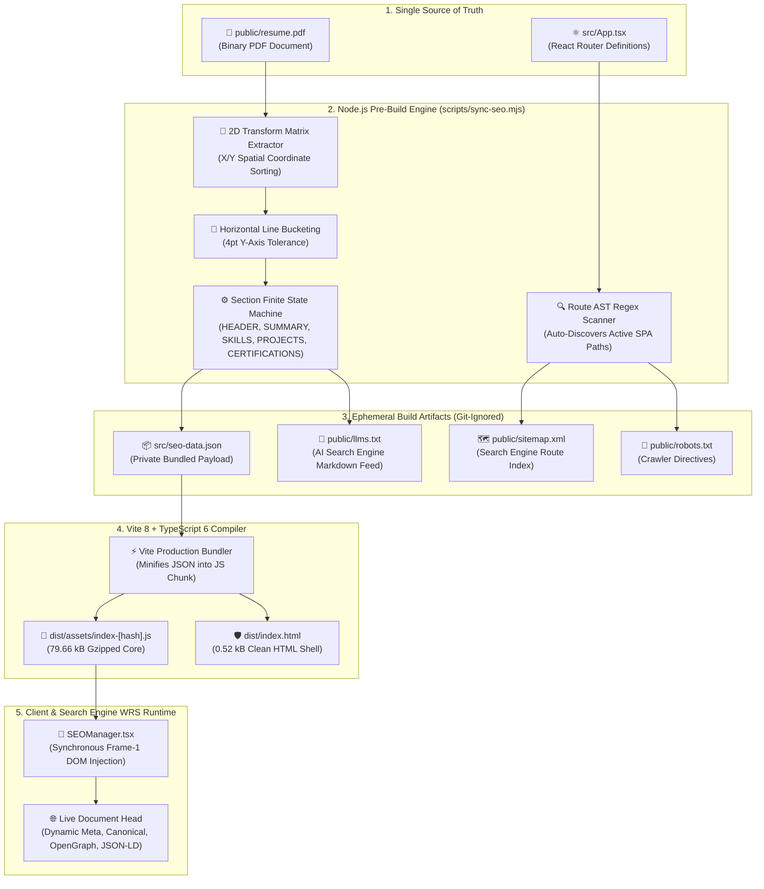

<div align="center">

# OSMAN AHMED KHAN — ENGINEERING PORTFOLIO
### Production Web Application & Automated PDF-to-SEO Extraction Engine

[](https://osmankhan.pages.dev)
[](#10-intellectual-property--licensing-policy)
[](#8-production-bundle-telemetry--benchmarks)
[](#8-production-bundle-telemetry--benchmarks)

[](https://react.dev/)
[](https://www.typescriptlang.org/)
[](https://vite.dev/)
[](https://tailwindcss.com/)
[](https://reactrouter.com/)
[](https://mozilla.github.io/pdf.js/)
[](https://pages.cloudflare.com/)

---

**⚠️ PROPRIETARY SOURCE CODE NOTICE**  
*This repository is publicly visible strictly for code inspection and technical evaluation by prospective employers and engineering peers. It is **not** open-source software. Cloning, forking for redistribution, template extraction, or commercial/personal reuse of the architecture, UI layout, or build scripts is strictly prohibited under international copyright law.*

</div>

---

## Table of Contents

1. [Executive Summary](#1-executive-summary)
2. [System Architecture & Data Flow](#2-system-architecture--data-flow)
3. [Coordinate-Sorted PDF-to-SEO Engine (`scripts/sync-seo.mjs`)](#3-coordinate-sorted-pdf-to-seo-engine-scriptssync-seomjs)
4. [Synchronous Runtime SEO & Schema Controller (`SEOManager.tsx`)](#4-synchronous-runtime-seo--schema-controller-seomanagertsx)
5. [Technology Stack & Dependency Matrix](#5-technology-stack--dependency-matrix)
6. [Repository Topology](#6-repository-topology)
7. [Build Pipeline & Lifecycle Automation](#7-build-pipeline--lifecycle-automation)
8. [Production Bundle Telemetry & Benchmarks](#8-production-bundle-telemetry--benchmarks)
9. [Edge Deployment Specification (Cloudflare Pages)](#9-edge-deployment-specification-cloudflare-pages)
10. [Intellectual Property & Licensing Policy](#10-intellectual-property--licensing-policy)

---

## 1. Executive Summary

This repository contains the production source code for **[osmankhan.pages.dev](https://osmankhan.pages.dev)**, the engineering portfolio of **Osman Ahmed Khan** (Software & Cloud Engineer).

Traditional single-page application (SPA) portfolios suffer from three recurring engineering defects:
1. **Metadata Drift:** Updating a resume PDF requires manually editing HTML meta tags, JSON-LD schemas, sitemaps, and component strings across multiple files.
2. **Client-Side Parsing Bloat:** Shipping PDF-parsing workers (`pdf.worker.min.mjs`, `~1.26 MB`) to the browser to extract metadata degrades Core Web Vitals and Time to Interactive (TTI).
3. **Raw Source Exposure:** Hardcoding personal contact details, keyword blocks, and raw resume text into `index.html` exposes personal identifiable information (PII) to automated email/phone harvesters via `View Page Source`.

This application solves all three problems through a **Zero-Touch Build-Time Extraction Pipeline**. Whenever `public/resume.pdf` is updated, a Node.js prebuild routine (`scripts/sync-seo.mjs`) parses the binary PDF by its 2D spatial coordinates, extracts structured sections, generates crawler feeds (`sitemap.xml`, `robots.txt`, `llms.txt`), and compiles sanitized metadata directly into the minified JavaScript bundle (`src/seo-data.json`).

---

## 2. System Architecture & Data Flow

The following diagram illustrates how `public/resume.pdf` acts as the single source of truth across both the Node.js build environment and the client-side React 19 runtime:



---

## 3. Coordinate-Sorted PDF-to-SEO Engine (`scripts/sync-seo.mjs`)

PDF documents do not store text in natural reading order; internal PDF streams often serialize text blocks out of sequence depending on how the document layout engine positioned frames. A naive text extraction results in scrambled sections and mid-sentence truncations.

`scripts/sync-seo.mjs` implements a deterministic 4-stage extraction algorithm:

### Stage 1: 2D Transform Matrix Extraction & Sorting
Every text item in `public/resume.pdf` is extracted alongside its 6-element affine transformation matrix `[a, b, c, d, x, y]`, where index `4` represents the horizontal `X` coordinate and index `5` represents the vertical `Y` coordinate:
* Items are sorted top-to-bottom by descending `Y` coordinate.
* Items sharing a vertical plane within a **4-point tolerance** (`|Y1 - Y2| <= 4`) are grouped into a single horizontal line bucket.
* Within each horizontal bucket, tokens are sorted strictly left-to-right by ascending `X` coordinate, reconstructing the exact visual reading order.

### Stage 2: Line-Level Finite State Machine (FSM)
Rather than relying on fragile multi-line regular expressions that can misfire when words like *"experience"* or *"projects"* appear inside body paragraphs, the parser iterates line-by-line through a state machine:
* State transitions occur **only** when a standalone uppercase heading line matches one of the canonical section identifiers (`SUMMARY`, `EDUCATION`, `TECHNICAL SKILLS`, `PROJECTS`, `EXPERIENCE`, `CERTIFICATIONS & ACHIEVEMENTS`).
* Hyphenated line wraps caused by PDF column justification are normalized back into contiguous tokens.

### Stage 3: Token Sanitization & PII Redaction
* **Identity Normalization:** The header parser strips typographic separator glyphs (`·`, `•`, `|`) and non-alphabetic characters to guarantee a clean entity name (`Osman Ahmed Khan`).
* **PII Protection:** Personal telephone numbers and raw email strings are intentionally excluded from the generated `src/seo-data.json` and `public/llms.txt` artifacts to prevent automated harvesting by spam crawlers.
* **Skill & Credential Tokenization:** Category prefixes (`Languages:`, `Frameworks & Web:`, `Cloud & DevOps:`, `AI & Machine Learning:`) are stripped, and individual technical competencies and certifications are normalized into deduplicated string arrays.

### Stage 4: Route Auto-Discovery
The script inspects `src/App.tsx` to extract all active `path="..."` declarations, automatically generating `public/sitemap.xml` with ISO-8601 `<lastmod>` timestamps and priority weights (`1.0` for `/`, `0.8` for secondary routes).

---

## 4. Synchronous Runtime SEO & Schema Controller (`SEOManager.tsx`)

To keep `View Page Source` (`dist/index.html`) completely free of hardcoded resume text while maintaining full compatibility with Google's Web Rendering Service (WRS), `src/components/SEOManager.tsx` manages document metadata at runtime:

* **Zero Network Latency:** Because `src/seo-data.json` is imported as an ES module (`import rawSeoData from '@/seo-data.json'`), Vite compiles the metadata directly into the main JavaScript bundle. There is no secondary `fetch('/seo-data.json')` network request or async race condition.
* **Route-Specific Metadata Mapping:** Listening to `useLocation()` from React Router, the controller dynamically rewrites `<title>`, `<meta name="description">`, `<meta name="keywords">`, Open Graph (`og:*`), and Twitter Card (`twitter:*`) tags for every route:
  * `/` — Portfolio overview and executive summary
  * `/work` — Engineering project descriptions and architecture stack
  * `/experience` — Professional experience and academic background
  * `/resume` — Condensed summary and full technical skill matrix
  * `/contact` — Verified professional profile links
* **Automatic 404 Protection:** Any unmapped route automatically receives `<meta name="robots" content="noindex, nofollow" />` and redirects its canonical tag to the root domain to prevent soft-404 index pollution.
* **Knowledge Graph JSON-LD Injection:** Synthesizes a Schema.org `ProfilePage` and `Person` entity graph in DOM memory, mapping `knowsAbout` to the 20 extracted technical skills, `hasCredential` to `EducationalOccupationalCredential` objects, and `sameAs` to verified GitHub and LinkedIn profile URIs.

---

## 5. Technology Stack & Dependency Matrix

| Layer | Package | Version | Architectural Role |
| :--- | :--- | :--- | :--- |
| **UI Runtime** | `react` / `react-dom` | `^19.2.8` | Concurrent UI rendering and component lifecycle management |
| **Type System** | `typescript` | `~6.0.2` | Strict static type checking (`strict: true`, `isolatedModules: true`) |
| **Build System** | `vite` | `^8.2.2` | Rollup/Rolldown ES module bundler and HMR development server |
| **Routing** | `react-router` | `^8.3.1` | Declarative client-side routing and location state synchronization |
| **Styling Engine** | `tailwindcss` / `@tailwindcss/vite` | `^4.3.3` | Zero-runtime utility CSS compilation and design token system |
| **Class Utilities** | `clsx` / `tailwind-merge` / `cva` | `^2.1.1` / `^3.6.0` | Deterministic conditional class merging and component variants |
| **UI Primitives** | `@radix-ui/react-slot` | `^1.3.3` | Polymorphic component composition and accessibility primitives |
| **Iconography** | `lucide-react` | `^1.42.0` | Tree-shakable SVG vector iconography |
| **PDF Engine** | `react-pdf` / `pdfjs-dist` | `^11.0.0` | Build-time Node.js PDF parsing and client-side `/resume` canvas rendering |
| **Static Analysis** | `eslint` / `typescript-eslint` | `^10.9.0` / `^8.67.0` | AST linting, React Hook dependency verification, and code quality enforcement |

---

## 6. Repository Topology

```text
portfolio/
├── public/
│   ├── _redirects                 # Cloudflare Pages SPA fallback rule (/* /index.html 200)
│   ├── favicon.svg                # Vector application identity icon
│   ├── resume.pdf                 # Primary binary source of truth for SEO & Resume view
│   ├── llms.txt                   # [Auto-Generated] AI crawler Markdown feed (Git-ignored)
│   ├── robots.txt                 # [Auto-Generated] Search crawler rules (Git-ignored)
│   └── sitemap.xml                # [Auto-Generated] Dynamic XML route map (Git-ignored)
├── scripts/
│   └── sync-seo.mjs               # Node.js coordinate-sorted PDF parser & artifact generator
├── src/
│   ├── components/
│   │   ├── SEOManager.tsx         # Synchronous DOM head & JSON-LD Knowledge Graph controller
│   │   └── ...                    # Navigation, layout shell, and reusable UI primitives
│   ├── pages/
│   │   ├── HomePage.tsx           # Executive landing view and core architecture highlights
│   │   ├── WorkPage.tsx           # Full-stack, Cloud, and AI/ML project case studies
│   │   ├── ExperiencePage.tsx     # Timeline of work history, B.Tech education, and credentials
│   │   ├── ResumePage.tsx         # Interactive PDF viewer with responsive mobile fallback
│   │   ├── ContactPage.tsx        # Direct communication and external profile links
│   │   └── NotFoundPage.tsx       # Catch-all 404 boundary with automated noindex directive
│   ├── seo-data.json              # [Auto-Generated] Extracted PDF metadata payload (Git-ignored)
│   ├── App.tsx                    # Root router configuration and lazy-loaded route boundaries
│   ├── main.tsx                   # React 19 DOM root mount point
│   └── index.css                  # Tailwind CSS v4 directives and custom theme tokens
├── .gitignore                     # Excludes build outputs and auto-generated SEO artifacts
├── eslint.config.js               # Flat ESLint configuration for TypeScript and React 19
├── index.html                     # Minimal 14-line HTML shell (0.52 kB raw / 0.32 kB gzip)
├── LICENSE                        # Proprietary All Rights Reserved copyright license
├── package.json                   # Dependency manifest and automated predev/prebuild hooks
├── tsconfig.app.json              # Application TypeScript compiler configuration
├── tsconfig.json                  # Solution-style TypeScript project references
├── tsconfig.node.json             # Node/Vite environment TypeScript configuration
└── vite.config.ts                 # Vite bundler plugins and @/* path alias resolution
```

---

## 7. Build Pipeline & Lifecycle Automation

The project uses npm lifecycle hooks (`predev` and `prebuild`) so that developers never have to manually trigger the SEO extraction script.

### Automated Command Matrix

| Command | Execution Chain | Operational Behavior |
| :--- | :--- | :--- |
| `npm run dev` | `predev` -> `vite` | Executes `scripts/sync-seo.mjs` to generate `src/seo-data.json` and public feeds from `public/resume.pdf`, then launches the Vite HMR server at `http://localhost:5173`. |
| `npm run prebuild` | `node scripts/sync-seo.mjs` | Standalone execution of the PDF coordinate parser and SEO artifact generator. |
| `npm run build` | `prebuild` -> `tsc -b` -> `vite build` | Synchronizes PDF metadata, validates strict TypeScript project references, and compiles minified production assets into `dist/`. |
| `npm run preview` | `vite preview` | Starts a local static web server at `http://localhost:4173` serving the compiled `dist/` production bundle. |
| `npm run lint` | `eslint .` | Executes static code analysis across all `.ts` and `.tsx` source files. |

### Zero-Code Resume Update Workflow

To update the live portfolio's metadata, skills, certifications, or downloadable resume:
1. Overwrite `public/resume.pdf` with the updated PDF document.
2. Commit and push to `main`:
   ```bash
   git add public/resume.pdf
   git commit -m "chore(resume): update resume.pdf"
   git push origin main
   ```
3. Cloudflare Pages automatically runs `prebuild` during deployment, extracting the new PDF contents and compiling them into the production bundle.

---

## 8. Production Bundle Telemetry & Benchmarks

By shifting PDF text extraction from the browser runtime to the Node.js `prebuild` stage, the production bundle eliminates `1,265.41 kB` of client-side PDF worker overhead on initial load and compiles in **600ms**.

### Verified Vite 8.2.2 Production Output

| Asset Chunk | Raw Size | Gzipped Size | Load Strategy |
| :--- | ---: | ---: | :--- |
| `dist/index.html` | `0.52 kB` | `0.32 kB` | Initial document shell |
| `dist/assets/index-[hash].css` | `35.43 kB` | `7.18 kB` | Render-blocking stylesheet |
| `dist/assets/index-[hash].js` | `247.80 kB` | `79.66 kB` | Core React 19 + Router + Bundled SEO JSON |
| `dist/assets/HomePage-[hash].js` | `7.46 kB` | `1.78 kB` | Route-split chunk (`/`) |
| `dist/assets/WorkPage-[hash].js` | `5.94 kB` | `2.19 kB` | Route-split chunk (`/work`) |
| `dist/assets/ExperiencePage-[hash].js` | `7.61 kB` | `1.90 kB` | Route-split chunk (`/experience`) |
| `dist/assets/ContactPage-[hash].js` | `8.96 kB` | `2.61 kB` | Route-split chunk (`/contact`) |
| `dist/assets/ResumePage-[hash].js` | `13.18 kB` | `3.34 kB` | Route-split chunk (`/resume`) |
| `dist/assets/NotFoundPage-[hash].js` | `32.51 kB` | `10.72 kB` | Route-split chunk (`/*` 404 fallback) |
| `dist/assets/terminal-[hash].js` | `0.19 kB` | `0.17 kB` | Shared icon/utility micro-chunk |

* **Total Initial Load (HTML + CSS + Core JS + Home Route):** `~88.94 kB` (gzipped)
* **Total Modules Transformed:** `1,923`
* **Total Production Compile Time:** `600ms`

---

## 9. Edge Deployment Specification (Cloudflare Pages)

The application is engineered for zero-configuration deployment on the Cloudflare Pages global edge network:

| Parameter | Configuration Value |
| :--- | :--- |
| **Production Domain** | `https://osmankhan.pages.dev` |
| **Framework Preset** | `Vite` |
| **Production Branch** | `main` |
| **Build Command** | `npm run build` *(automatically triggers `npm run prebuild`)* |
| **Build Output Directory** | `dist` |
| **Node.js Runtime Version** | `20.x` / `22.x` LTS |
| **SPA Edge Routing** | Enforced via `public/_redirects` (`/* /index.html 200`) |

---

## 10. Intellectual Property & Licensing Policy

### Copyright © 2026 Osman Ahmed Khan. All Rights Reserved.

This repository and all associated source code, user interface designs, layout compositions, custom build scripts (`scripts/sync-seo.mjs`), component architectures (`src/components/SEOManager.tsx`), and personal career documents (`public/resume.pdf`) are the **exclusive proprietary intellectual property of Osman Ahmed Khan**.

This project is **NOT** licensed under MIT, Apache, GPL, BSD, or any other open-source license. Making this repository publicly visible on GitHub does not waive copyright or grant any implied license for reuse.

| Action | Policy Status | Legal Scope |
| :--- | :---: | :--- |
| **Viewing Source Code on GitHub** | ✅ **Permitted** | Allowed for technical evaluation, code review, and hiring assessment. |
| **Cloning / Copying for Personal Portfolios** | ❌ **Strictly Prohibited** | You may not copy, adapt, or deploy this codebase or UI for your own website. |
| **Redistribution or Template Publishing** | ❌ **Strictly Prohibited** | You may not republish, package, or distribute any portion of this repository. |
| **Commercial or Derivative Use** | ❌ **Strictly Prohibited** | No derivative works, commercial use, or relicensing is permitted under any circumstances. |
| **Use of Personal Identity & Resume Data** | ❌ **Strictly Prohibited** | All biographical data, project descriptions, and PDFs belong solely to Osman Ahmed Khan. |

Unauthorized reproduction, redistribution, or deployment of this codebase or its visual design will result in a formal **DMCA Takedown Notice** filed with GitHub and the offending hosting provider (Cloudflare, Vercel, Netlify, etc.).

See the [LICENSE](./LICENSE) file for the full legal terms.

<br />

---

<div align="center">

<a href="https://osmankhan.pages.dev">
  
</a>

<br /><br />

<samp>
  <b>O S M A N &nbsp; A H M E D &nbsp; K H A N</b><br />
  <sub>SOFTWARE ENGINEERING &nbsp;·&nbsp; CLOUD ARCHITECTURE &nbsp;·&nbsp; AI SYSTEMS</sub>
</samp>

<br /><br />

<p align="center">
  <a href="https://osmankhan.pages.dev">
    
  </a>
  &nbsp;
  <a href="https://github.com/OsmanAhmedKhan">
    
  </a>
  &nbsp;
  <a href="https://linkedin.com/in/osman-ahmedkhan">
    
  </a>
  &nbsp;
  <a href="https://osmankhan.pages.dev/work">
    
  </a>
</p>

<samp>
  <sub>
    <a href="https://osmankhan.pages.dev">Website</a> &nbsp;•&nbsp;
    <a href="https://osmankhan.pages.dev/work">Work</a> &nbsp;•&nbsp;
    <a href="https://osmankhan.pages.dev/experience">Experience</a> &nbsp;•&nbsp;
    <a href="https://osmankhan.pages.dev/resume">Resume</a> &nbsp;•&nbsp;
    <a href="https://osmankhan.pages.dev/contact">Contact</a>
  </sub>
</samp>

<br /><br />

<sub>
  Copyright © 2026 <b>Osman Ahmed Khan</b>. All Rights Reserved.
</sub>

</div>